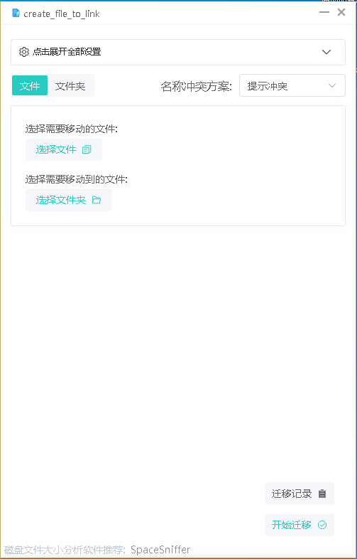
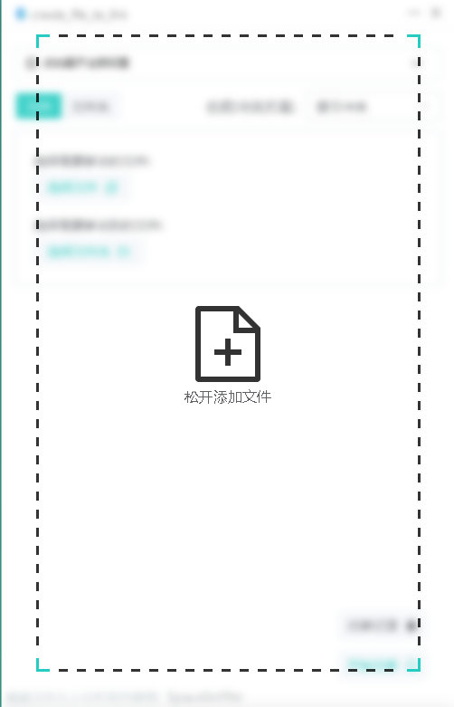
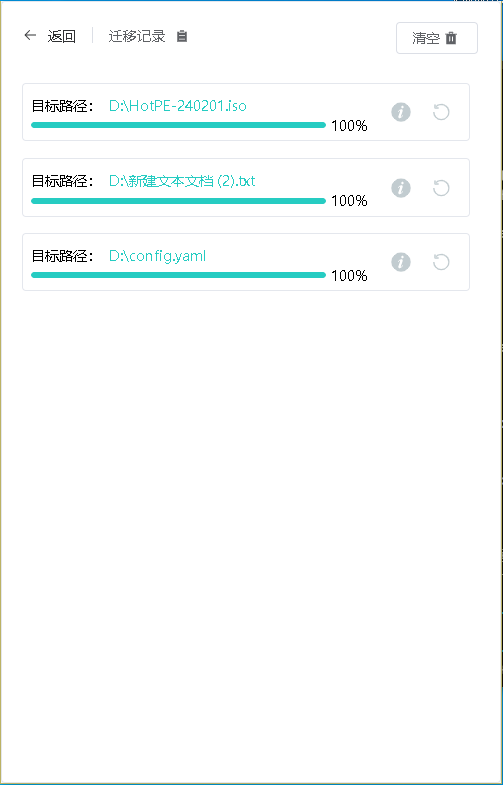

# create_file_to_link

> Windows 桌面工具：将文件/文件夹移动或复制到目标目录，并自动创建符号链接。

## 功能

- **拖拽添加** — 从资源管理器直接拖文件/文件夹到窗口
- **文件选择** — 通过系统对话框选择文件或文件夹
- **移动 / 复制** — 支持文件或文件夹的剪切与复制操作
- **自动创建软链接** — 移动/复制完成后在原位置创建指向新位置的符号链接
- **批量操作** — 支持多文件/多文件夹同时处理
- **进度展示** — 实时显示操作进度
- **历史记录** — 每次操作记录在历史页面，含文件列表和大小
- **撤销操作** — 支持一键撤销已完成的迁移操作
- **深色主题** — 支持亮色/暗色模式切换
- **命名冲突处理** — 三种冲突策略：覆盖、跳过、添加后缀

## 截图

> 将截图放在 `screenshots/` 目录下，替换以下占位：

| 主界面 | 拖拽效果 | 历史记录 |
|--------|----------|----------|
|  |  |  |

## 安装

### 下载安装包

从 [Releases](https://github.com/keduoli-lovely/create_file_to_link/releases) 下载最新版本：

- `create_file_to_link_x64-setup.exe` — NSIS 安装包（推荐）
- `create_file_to_link_x64_en-US.msi` — MSI 安装包
- `create_file_to_link.exe` — 便携版（需系统已安装 WebView2 运行时）

### 系统要求

- Windows 10 及以上
- WebView2 运行时（安装包会自动安装，便携版需手动安装）
- **管理员权限**（创建软链接必需）

## 使用说明

1. **启动应用** — 双击 exe，在弹出的 UAC 确认窗口中选择"是"
2. **添加文件** — 从资源管理器拖入，或点击"选择文件"/"选择文件夹"
3. **选择目标** — 点击"选择目标路径"指定文件/文件夹的新位置
4. **执行操作** — 点击"移动"或"复制"，文件被搬走的同时在原地创建软链接
5. **查看历史** — 切换到"历史记录"标签查看所有操作记录
6. **撤销操作** — 点击历史记录旁的撤销按钮回滚操作

### 命名冲突处理

在设置中可配置重名时的处理方式：
- **覆盖** — 直接覆盖已存在的文件
- **跳过** — 保留原文件不处理
- **添加后缀** — 为新文件添加 `_link` 后缀

## 开发

### 技术栈

| 层 | 技术 |
|---|------|
| 前端 | Vue 3 + Vite + Pinia + Element Plus + TypeScript |
| 后端 | Rust + Tauri v2 |
| 打包 | NSIS / MSI |

### 项目结构

```
src/                          # Vue 前端
├── App.vue                   # 主组件
├── views/                    # 页面组件
│   ├── History_card.vue      # 历史记录卡片
│   ├── select_dir.vue        # 目标路径选择
│   ├── select_file.vue       # 文件选择与标签
│   └── drag_shrink.vue       # 拖拽动画覆盖层
├── composables/              # 组合式函数
│   ├── useFileOperation.ts   # 文件操作（选择、复制、移动、软链接）
│   ├── useDragFile.ts        # 拖拽事件处理
│   ├── useAppListener.ts     # Tauri 事件监听
│   ├── useProgress.ts        # 进度事件
│   ├── useHistory.ts         # 历史记录管理
│   └── useChangeTheme.ts     # 主题切换
├── stores/                   # Pinia 状态管理
│   ├── useConfigStore.ts     # 用户配置
│   ├── useFileStore.ts       # 选中文件
│   ├── useHistoryStore.ts    # 历史记录列表
│   ├── useProgressStore.ts   # 操作进度
│   └── useDragStore.ts       # 拖拽 UI 状态
├── types/                    # TypeScript 类型定义
├── utils/                    # 工具函数
└── css/                      # 样式

src-tauri/                    # Rust 后端
├── src/
│   ├── lib.rs                # 入口、事件注册、UIPI 绕过
│   ├── create_file_link.rs   # 软链接创建
│   ├── copy_move_file.rs     # 文件复制/移动 + 回滚
│   ├── undo_operation.rs     # 撤销操作
│   └── check_file_disk/      # 磁盘空间检查
├── build.rs                  # 构建配置（管理员 manifest）
├── Cargo.toml                # Rust 依赖
└── tauri.conf.json           # Tauri 配置
```

### 开发命令

```bash
npm install           # 安装前端依赖
npm run tauri dev     # 开发模式（热更新）
npm run tauri build   # 生产构建
```

## 许可证

MIT License — 详见 [LICENSE](LICENSE) 或安装包中的许可协议。
